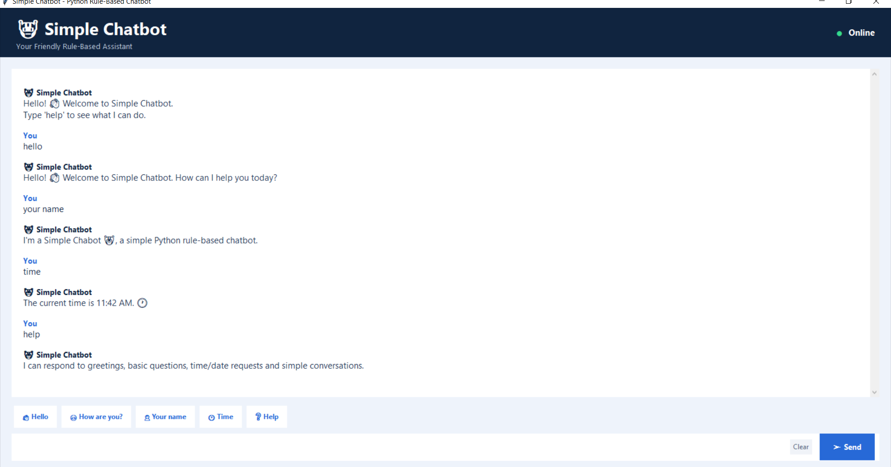

# 🤖 Simple Chatbot

A professional desktop-based **rule-based chatbot** developed using Python and Tkinter.
The chatbot provides predefined responses to user messages and demonstrates fundamental Python programming concepts 
through an interactive graphical user interface.

## ✨ Features

- 👋 Greeting responses
- 😊 "How are you?" conversation
- 🤖 Chatbot name and introduction
- 🕐 Current time
- 📅 Current date
- ❓ Help and available commands
- 🙏 Thank-you responses
- 👋 Goodbye response
- ⚡ Quick-reply buttons
- 🧹 Clear chat option
- ⌨️ Enter key support
- 🖥️ User-friendly Tkinter GUI

## 🧠 Concepts Used

- `if-elif-else`
- Functions
- String handling
- Conditional logic
- Event handling
- User input/output
- GUI development
- Date and time handling

## 📁 Project Structure

```text
simple-rule-based-chatbot/
│
├── chatbot.py
├── README.md
├── .gitignore
└── chatbot-screenshot.png
```

## 🖥️ Application Preview




🎯 Project Objective
The objective of this project is to build a simple rule-based chatbot while practicing Python fundamentals such as 
conditional statements, functions, event handling, user input/output, and GUI development.

## 🛠️ Technologies Used

- Python
- Tkinter
- DateTime
- Object-oriented and event-driven GUI concepts

## ▶️ How to Run

### 1. Clone the repository

```bash
git clone https://github.com/ayurshi1293/simple-rule-based-chatbot.git

